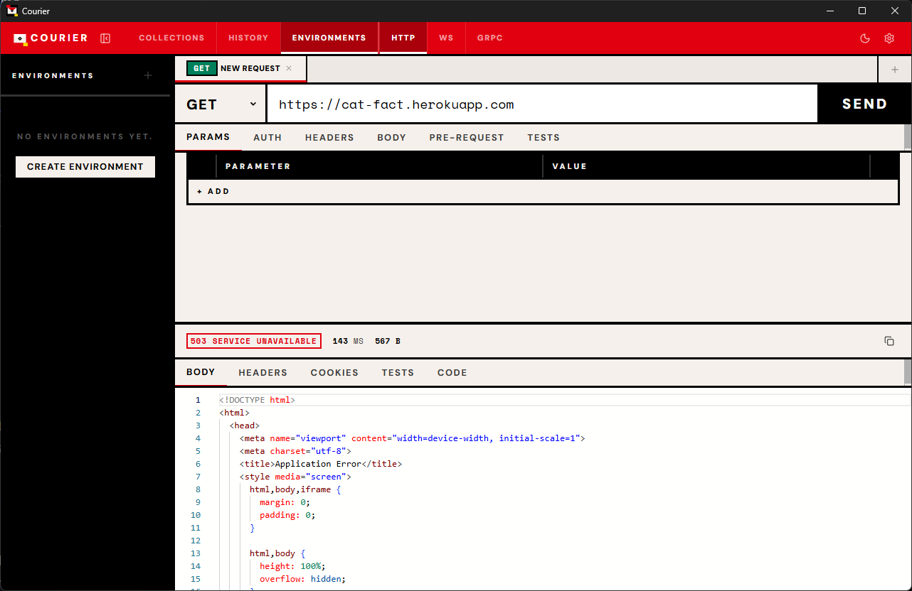
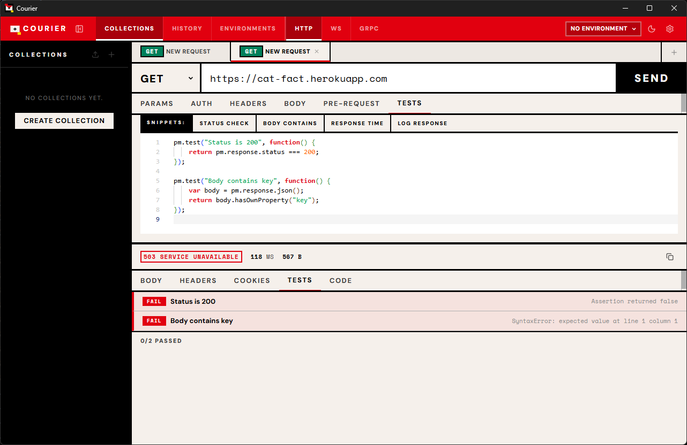
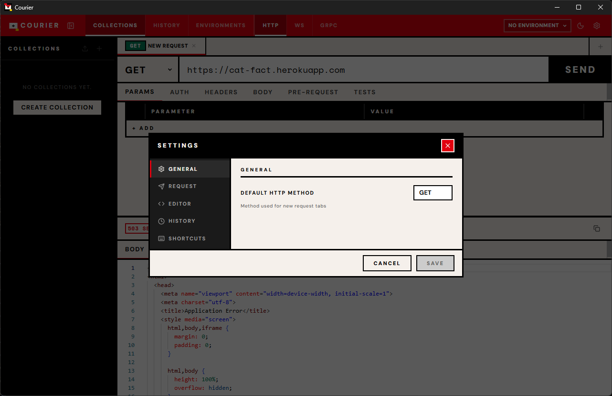
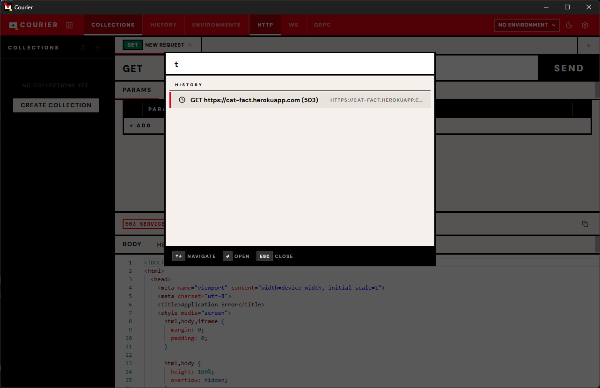

# Courier

A fast, local-first API development platform for desktop. Courier is a native alternative to Postman, built with Tauri v2 and React 19, featuring a Mondrian/Bauhaus-inspired interface with zero border-radius, heavy structural lines, and color-coded functional zones.

All data stays on your machine in a local SQLite database. No accounts, no cloud sync, no telemetry.

<!--
  Screenshots -- run `scripts/take-screenshots.ps1` to generate, then uncomment:

  
  
  
-->

---

## Features

### HTTP Client
- Full HTTP method support: GET, POST, PUT, PATCH, DELETE, HEAD, OPTIONS
- Request builder with query parameters, headers, body editor, and authentication
- Body types: JSON, XML, plain text, HTML, JavaScript, GraphQL
- Response viewer with syntax-highlighted body, headers table, cookies, and code generation
- Request history with automatic logging, search, and method filtering
- Tab system for working with multiple requests simultaneously

### Authentication
- Bearer Token
- Basic Auth
- API Key (header or query parameter)
- OAuth 2.0 (manual access token with configurable header prefix)
- Digest Auth (MD5 challenge-response, full RFC 2617 implementation)

### Collections and Organization
- Named collections with nested folder support
- Drag-and-drop reordering of collections and requests
- Postman v2.1 format import and export
- Global search across all collections, requests, and URLs (Ctrl+K)

### WebSocket Client
- Real-time bidirectional communication
- Connection status indicator
- Message log with sent/received/system indicators and timestamps
- Message composer with send-on-enter

### gRPC Client
- Proto file loading and parsing
- Unary and server-streaming RPC calls
- Service and method browser
- Metadata editor for gRPC headers
- Schema explorer with message type introspection, field details, and nested type navigation

### GraphQL Support
- Split-pane query and variables editor
- Automatic JSON payload construction
- Content-Type header auto-set

### Code Generation
- Generate request code in 11 languages:
  - curl
  - JavaScript (Fetch API)
  - JavaScript (Axios)
  - Python (Requests)
  - Rust (Reqwest)
  - Go (net/http)
  - Java (HttpClient)
  - C# (HttpClient)
  - PHP (cURL)
  - Ruby (Net::HTTP)
  - Swift (URLSession)

### Scripting and Testing
- Pre-request scripts (JavaScript, powered by boa_engine)
- Test scripts with assertions
- Console output capture
- Environment variable access from scripts
- Collection runner with sequential execution, progress tracking, and pass/fail statistics

### Environment Variables
- Multiple named environments
- Variable interpolation in URLs, headers, body, and auth fields using `{{variable}}` syntax
- Quick environment switching from the top bar

### Settings
- Configurable request defaults (timeout, redirect following, SSL verification, user agent)
- Editor preferences (font size, tab size, word wrap)
- History retention settings
- Keyboard shortcut reference

### Keyboard Shortcuts

| Action | Shortcut |
|--------|----------|
| Send request | Ctrl+Enter |
| New tab | Ctrl+N |
| Close tab | Ctrl+W |
| Save request | Ctrl+S |
| Toggle sidebar | Ctrl+B |
| Focus URL bar | Ctrl+L |
| Global search | Ctrl+K |
| Settings | Ctrl+, |
| New collection | Ctrl+Shift+N |
| Switch to tab 1-9 | Ctrl+1-9 |

---

## Design

Courier uses a Mondrian/Bauhaus-inspired visual system:

- **Typography**: DM Sans for interface text, Space Mono for code and URLs
- **Color palette**: Signal red (#E1000F), true black (#000000), warm white (#F5F0EB), deep yellow (#FFD700)
- **Zero border-radius** on all elements
- **Heavy structural borders** (3-4px solid black) dividing functional zones
- **Color-coded areas**: red for the top control strip, black for the sidebar, warm white for content, yellow for warnings
- **Dark theme** with full variable override system

<!--
  
  
-->

---

## Tech Stack

| Layer | Technology |
|-------|------------|
| Desktop framework | Tauri v2 |
| Backend language | Rust |
| HTTP client | reqwest |
| Database | SQLite (rusqlite, bundled) |
| WebSocket | tokio-tungstenite |
| gRPC | tonic + protox + prost-reflect |
| Scripting engine | boa_engine (pure Rust JS) |
| Frontend framework | React 19 |
| Language | TypeScript 5.9 |
| State management | Zustand 5 (slices pattern) |
| Code editor | Monaco Editor |
| Styling | CSS Modules |
| Layout | react-resizable-panels |
| Drag and drop | @dnd-kit |
| Virtualization | @tanstack/react-virtual |
| Icons | Lucide React |
| Build tool | Vite 6 |

---

## Quick Start

### Prerequisites

- Node.js >= 18
- Rust >= 1.93.0 (`rustup update stable`)
- Platform-specific Tauri v2 dependencies (see [SETUP.md](SETUP.md))

### Build and Run

```
git clone <repository-url>
cd courier
npm install
npm run tauri dev
```

The first build takes several minutes while Rust dependencies compile. Subsequent builds are incremental.

### Production Build

```
npm run tauri build
```

Produces platform-specific installers in `src-tauri/target/release/bundle/`:

| Platform | Installer formats |
|----------|-------------------|
| Windows | MSI, NSIS exe |
| macOS | DMG |
| Linux | deb, rpm, AppImage |

---

## Project Structure

```
courier/
  src/                      Frontend (React + TypeScript)
    components/             UI components organized by feature
    stores/                 Zustand state management (7 slices)
    styles/                 CSS variables, reset, global styles
    types/                  TypeScript interfaces
    utils/                  Tauri IPC wrappers, variable interpolation
    hooks/                  Keyboard shortcuts

  src-tauri/                Backend (Rust)
    src/
      commands/             Tauri command handlers (13 modules)
      db/                   SQLite schema and CRUD operations
      http/                 HTTP client and digest auth
      grpc/                 gRPC client and proto parsing
      codegen/              Code generation (11 languages)
      scripting/            JavaScript scripting engine
      websocket/            WebSocket connection manager
      models/               Data models
```

See [SETUP.md](SETUP.md) for detailed development instructions, dependency tables, and troubleshooting.

---

## Data Storage

All data is stored locally in a SQLite database using WAL mode. No network requests are made except those explicitly initiated by the user. The database location is platform-specific:

| Platform | Path |
|----------|------|
| Windows | `%APPDATA%\com.courier\courier.db` |
| macOS | `~/Library/Application Support/com.courier/courier.db` |
| Linux | `~/.local/share/com.courier/courier.db` |

---

## Screenshots

To generate screenshots for documentation:

```
powershell -ExecutionPolicy Bypass -File scripts\take-screenshots.ps1
```

Options:

| Flag | Description |
|------|-------------|
| `-DevMode` | Launch via `npm run tauri dev` instead of the release binary |
| `-SkipLaunch` | Capture screenshots of an already-running instance |
| `-Delay <ms>` | Adjust delay between actions (default: 2000) |
| `-OutDir <path>` | Custom output directory (default: `docs/screenshots`) |

Screenshots are saved as PNG files in `docs/screenshots/`.

---

## License

MIT
